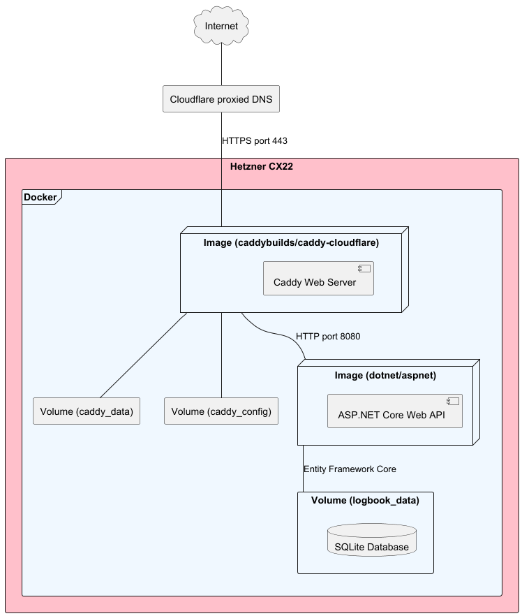

# ICT Conscript Admission Test Submission

[](https://github.com/tnikFi/test-ictconscript-admission/actions/workflows/ci-cd.yml)

This repository contains my submission for the ICT Conscript Admission Test.

## Completed challenges

| Challenge             | Notes                                                |
|-----------------------|------------------------------------------------------|
| 01b-swdev-backend-api | Built using ASP.NET Core.                            |
| 02a-devops-docker     | Requires a Cloudflare API token. More details below. |

## Links

- API base URL: **[https://logbook.tnik.fi/](https://logbook.tnik.fi/)**
- Swagger UI: **[https://logbook.tnik.fi/swagger/index.html](https://logbook.tnik.fi/swagger/index.html)**

## Backend API

The backend API is built using ASP.NET Core and can be run locally either using Docker or directly with the .NET SDK
for development purposes.

### General information

- Outside a Docker container, the API runs on port `5198`.
- Inside a Docker container, the API runs on port `8080`.
- Database schema is managed using a code-first approach with Entity Framework Core.
  - The database is created automatically on application startup if it does not exist.
  - Any pending migrations are applied automatically on startup.
  - The migrations include seed data that populates the database with initial values on the first run.
- A Swagger UI is available at `/swagger/index.html` for testing the API endpoints.
- The API is built and tested by a GitHub Actions workflow that runs on every push to the `main` branch.

### Running the API with Docker

To run just the API using Docker, you can use the following command in the root directory of the repository:

```bash
$ docker build . && docker run -p 8080:8080 <image-id>
```

The Dockerfile automatically builds the API and runs tests (currently 20 test cases).
Failing tests will cause the Docker build to fail.

## DevOps (Docker)

Docker Compose is used to deploy the API and a Caddy reverse proxy with automatic TLS certificate setup using
Cloudflare as the DNS provider.

### General information

- The Docker Compose setup includes:
  - The backend API running on port `8080` inside the container.
  - A Caddy reverse proxy that listens on port `443` for HTTPS traffic.
    - This application uses the [caddybuilds/caddy-cloudflare](https://hub.docker.com/r/caddybuilds/caddy-cloudflare)
      image, which is a custom Caddy build that supports DNS-01 challenges with Cloudflare.
- Cloudflare's proxied DNS is used for DDoS protection and to preventing direct access to the API's origin IP address.
  - The required Cloudflare API token is stored as a production environment variable named `CLOUDFLARE_API_TOKEN`.
- The application is deployed to a VPS that also acts as a GitHub Actions runner for deployments.
- Deployments can only happen if tests pass and the API build is successful.
- Data in the application's database is persisted between deployments using a Docker volume.

### Manual deployment

This section contains instructions for deploying the API and Caddy reverse proxy using Docker Compose.
Since the application uses Cloudflare's proxied DNS to avoid exposing the origin IP address, some extra steps are
required to deploy the application.

If you don't use Cloudflare as the DNS provider to deploy the API, you can skip the Cloudflare API token setup but may
need to modify the docker-compose.yml and Caddyfile since they're configured to use Cloudflare.

#### Cloudflare API token setup

Using Cloudflare's proxied DNS prevents Caddy's default TLS certificate management from working, so deploying requires
a Cloudflare API token to be set as the `CLOUDFLARE_API_TOKEN` environment variable. To get started, go to your Cloudflare
profile, navigate to API Tokens, and create a new custom token with the configurations below.

- **Name**: Any descriptive name, e.g., "Logbook Caddy DNS-01 Challenge"
- **Permissions**
  - Zone: Zone: Read
  - Zone: DNS: Edit
- **Zone Resources**
  - Include: Specific zone
  - Select the zone you want to use (e.g., `example.com`)
  - Note: You can also apply the token to all zones, but this is not recommended for security reasons.
- **Client IP Address Filtering**:
  - Is in: IPv4 and IPv6 addresses of your server
- **TTL**: Optional. Automatic certificate renewal will work until the token expires, but you can set a TTL for
  the token if you want to limit its lifetime.

#### Running the application

To run the application using Docker Compose, you can use the following command in the root directory of the repository:

```bash
$ docker compose up -d
```

To use a Cloudflare API token, you can set the `CLOUDFLARE_API_TOKEN` environment variable when running the command:

```bash
$ CLOUDFLARE_API_TOKEN=<your-cloudflare-api-key> docker compose up -d
```

## Deployment diagram


